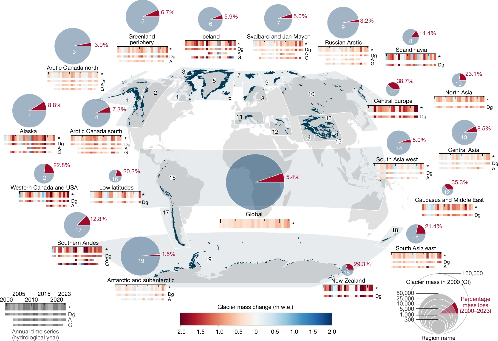
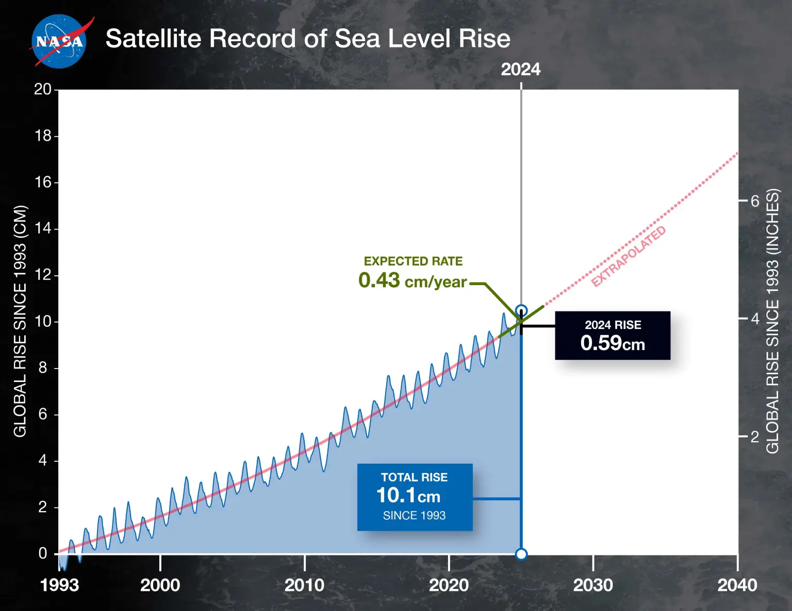
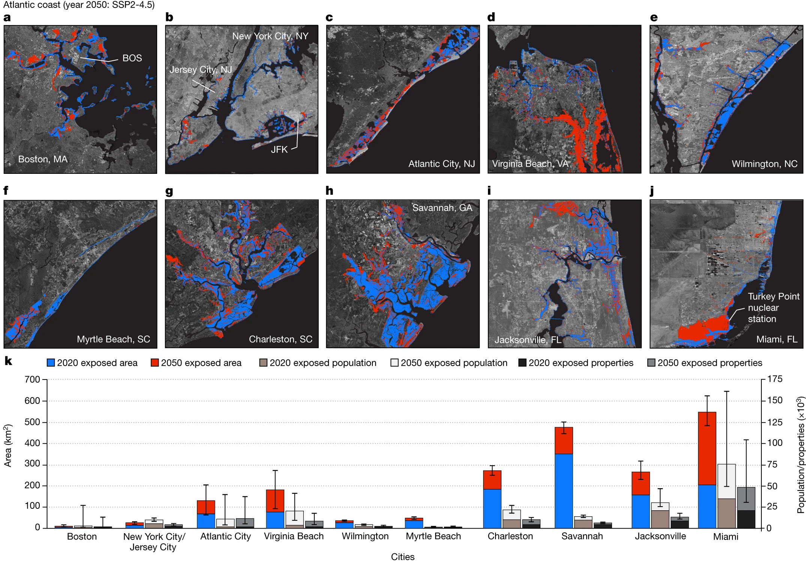
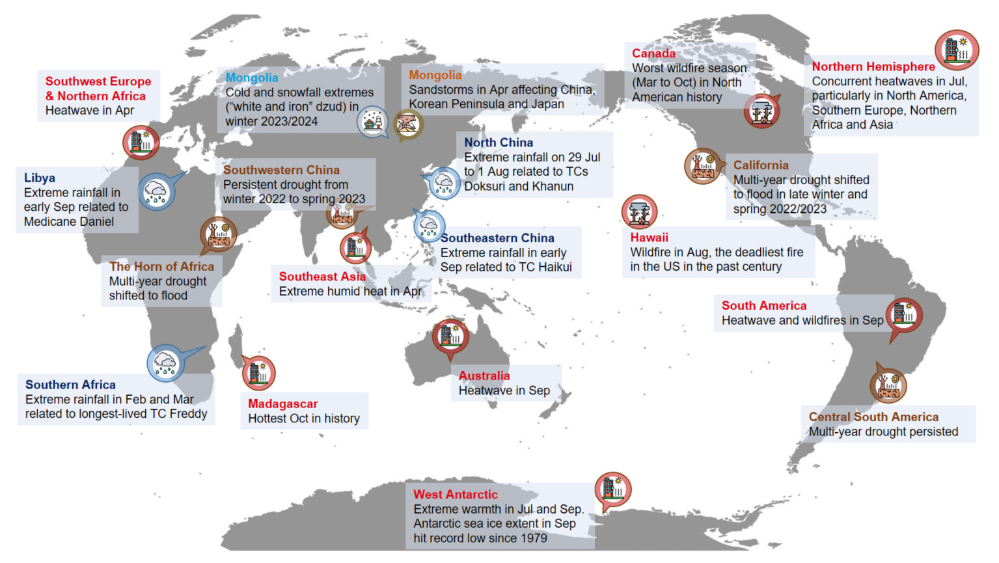
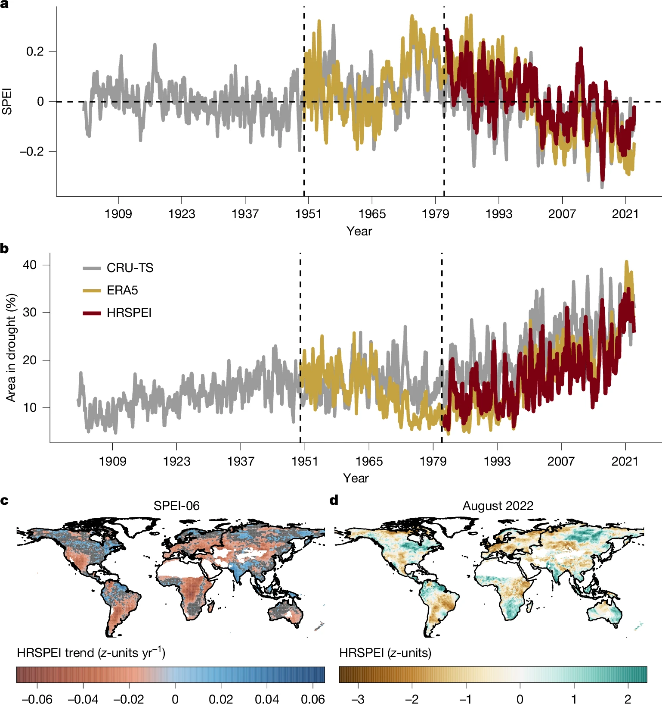
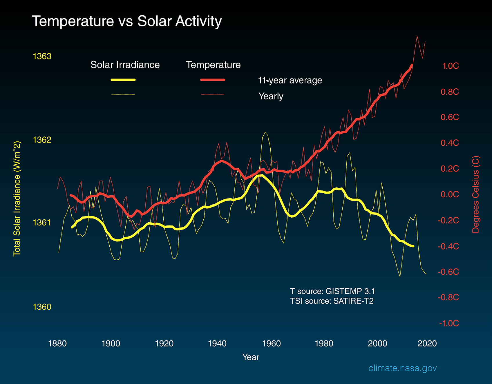
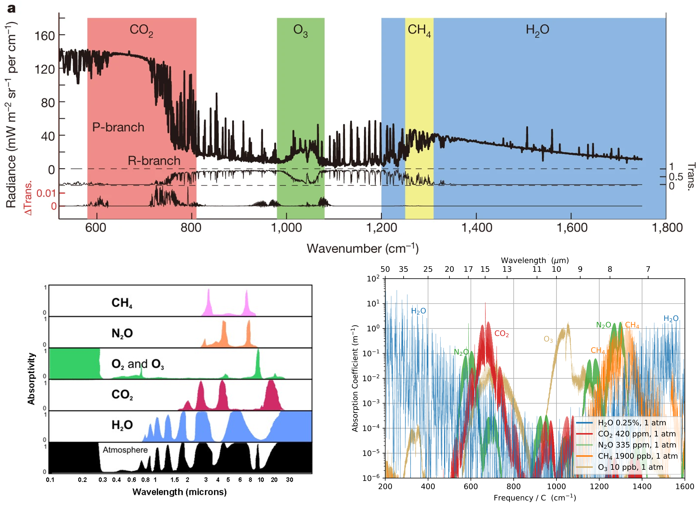
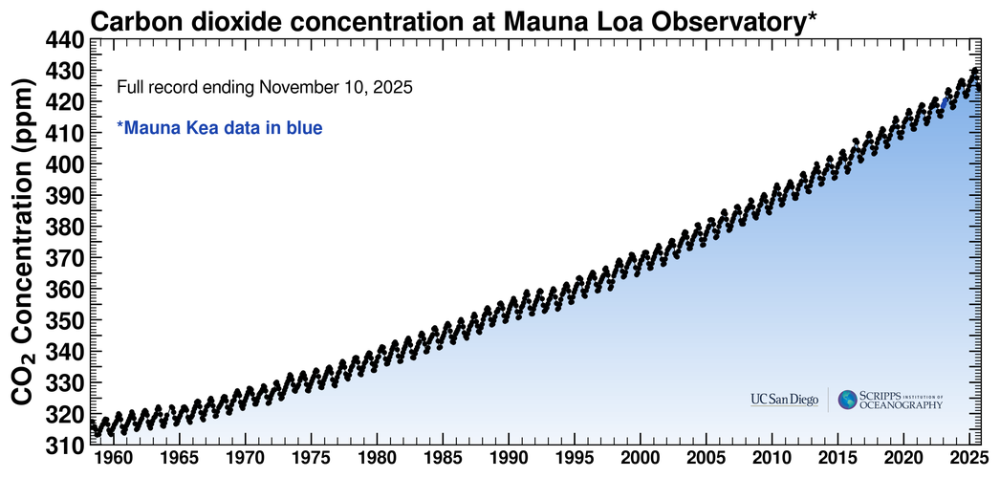
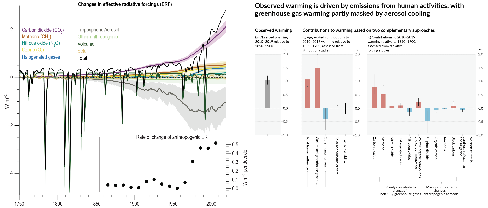
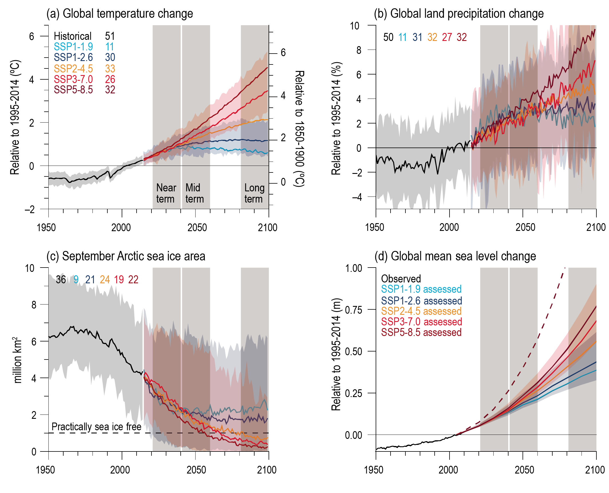

<!--
  Title: Class notes on Climate Change
  Author: Zewei Ma
  Date: 2025-11-01
-->

# Climate Change Notes

## Overall question

- Question 1: What is climate change, and are there any signs suggest it is happening (What has happened and is happening)?
- Question 2: What are the causes of climate change and the role of human behavior?
- Question 3: What are the differences and connections between climate change and global warming?
- Question 4: What are RCPs and SSPs in climate change research, and how do they differ? How are they used to model future climate scenarios in IPCC?
- Question 5: What are going to happen in the future?
- Question 6: What is GCMs, CMs, IAMs, ESMs? How do they work together to help us understand climate change?

## Some links

### Online videos

- [AR6 Synthesis Report: Climate Change 2023 | IPCC](https://www.youtube.com/watch?v=YIFCSZYU2LM)
- [Nobel Prize lecture: Syukuro Manabe, Nobel Prize in physics 2021](https://www.youtube.com/watch?v=-VNKJ2IbRoo&list=PPSV)
- [The Tipping Points of Climate Change — and Where We Stand | Johan Rockström | TED](https://www.youtube.com/watch?v=Vl6VhCAeEfQ)
- [How scientists calculate climate change | The Economist](https://www.youtube.com/watch?v=fSGorwtY-zM)
- [A Year in the Life of Earth's CO2 | NASA](https://www.youtube.com/watch?v=x1SgmFa0r04&list=PLQVWjfOruX-x7DVigo9P2rfknMVFASc5-)
- [What is climate change? - The Climate Question | BBC](https://www.youtube.com/watch?v=SLEenW2UiUw)
- [Annual Arctic Sea Ice Minimum Area 1979-2022, With Graph | NASA](https://www.youtube.com/watch?v=njoTDqwFuuU)
- [A selection of GraphCast’s predictions rolling across 10 days | Google](https://www.youtube.com/watch?v=xwSirqS8meQ)
- [See what three degrees of global warming looks like | The Economist](https://www.youtube.com/watch?v=uynhvHZUOOo&t=22s)
- [The carbon cycle is key to understanding climate change | The Economist](https://www.youtube.com/watch?v=yhlg9txl7yM)
- [Climate Change Adaptation and Future Climate Projection | CCCA](https://www.youtube.com/watch?v=8jhSHm7qjBg)
- [In a warmer world, tornado behaviour is changing – this is how we can prepare | BBC](https://www.bbc.com/future/article/20240522-climate-change-experts-advise-how-to-prepare-for-a-tornado)
- [Neural General Circulation Models for Weather + Climate | LEAP & Google Research](https://www.youtube.com/watch?v=Y8rX4g0k9tw)

### Other links

- [NASA climate change | NASA](https://science.nasa.gov/climate-change/)
- [NASA climate change primer | NASA](https://climateprimer.org/)
- [How to read the Intergovernmental Panel on Climate Change's reports | Carbon Brief](https://www.carbonbrief.org/how-to-read-the-intergovernmental-panel-on-climate-changes-reports/)
- [NOAA climate monitoring | NOAA](https://www.ncei.noaa.gov/access/monitoring/products/)
- [Climate Reanalyzer | Climate Reanalyzer](https://climatereanalyzer.org/)
- [World Glacier Monitoring Service | WGMS](https://wgms.ch/)
- [Understanding Shared Socio-economic Pathways (SSPs) | Climate Data Canada](https://climatedata.ca/resource/understanding-shared-socio-economic-pathways-ssps/)
- [Drought Impact Reporter Dashboard | University of Nebraska](https://unldroughtcenter.maps.arcgis.com/apps/dashboards/46afe627bb60422f85944d70069c09cf)
- [The European Drought Reference Database | EDO](https://geo.uio.no/edc/droughtdb/)
- [How do hurricanes or typhoons form and are they getting stronger? | BBC](https://www.bbc.com/news/articles/cz913gxlw3jo)
- [Global Warming and Hurricanes | GTFL](https://www.gfdl.noaa.gov/global-warming-and-hurricanes/#:~:text=Tropical%20cyclone%20intensities%20globally%20are,of%20all%20tropical%20cyclones%20combined.)
- [Tornado Plots for Illinois | Illinos state water survey](https://stateclimatologist.web.illinois.edu/tornado-plots-for-illinois/#:~:text=Tornadoes%2C%20Fatalities%2C%20and%20Injuries%20by%20F%2DScale,EF%2D3%20and%20weaker%20tornadoes.)
- [Causes of Climate Change | EPA](https://www.epa.gov/climatechange-science/causes-climate-change)
- [Climate Change Evidence and Causes: Update 2020 | The National Academy of Sciences; The Royal Society](https://nap.nationalacademies.org/catalog/25733/climate-change-evidence-and-causes-update-2020)
- [What causes the Earth's climate to change? | British Geological Survey](https://www.bgs.ac.uk/discovering-geology/climate-change/what-causes-the-earths-climate-to-change/)
- [Has volcanic activity been increasing? | Smithsonian Institution](https://volcano.si.edu/faq/index.cfm?question=historicalactivity)
- [Aerosols: Tiny Particles, Big Impact | NASA](https://science.nasa.gov/earth/earth-observatory/aerosols/)
- [Fast, accurate climate modeling with NeuralGCM | Google AI Blog](https://research.google/blog/fast-accurate-climate-modeling-with-neuralgcm/)
- [Cities and Climate Change | MIT open class](https://dusp.mit.edu/news/cities-and-climate-change)
- [Responding to Climate Change | NASA](https://science.nasa.gov/climate-change/adaptation-mitigation/)
- [Top Takeaways from the UN World Leaders Summit at COP26 | World Resources Institute](https://www.wri.org/insights/top-takeaways-un-world-leaders-summit-cop26)

## Signs of climate change

There are multiple signs suggest climate change is happening, two of types of them are: long-term change and extreme events.

### Temperature rise

By 2024, the global mean surface temperature has risen by 1.45°C compared with the pre-industrial level (1850-1900 average) [^WMO2024]. Recently, the warming rate accelerated.

<b>Figure. Global temperature history</b>

<figure>
  

    
  

  <figcaption>
    <b>Figure. Global temperature history</b> The temperature has now reached a new point compared to the Holocene.
  </figcaption>
</figure>

<b>Figure. Sea surface temperature</b>

<figure>
  

  
  

  <figcaption><b>Figure. Sea surface temperature history</b> The sea surface temperature reached a new record since 2023, compared with previous years. (https://climatereanalyzer.org/clim/sst_daily/?dm_id=world2)</figcaption>
</figure>

### Ice melt

The climate change also causes the ice sheet melt. A community estimation of global glacier mass change (except for Greenland and Antarctic icesheets) from 2000 to 2023 reduces 5.4% of the total mass [^GlaMBIE2025].

The Arctic and Antarctic sea ice extent are two major ice sheets in the earth that are influenced by climate change. The monitoring data shows that both ice sheets are shrinking, and the ice extent reaches new low records in recent years.

<b>Figure. Global glacier mass changes from 2000 to 2023</b>

<figure>
  

  
  

  <figcaption><b>Figure. Global glacier mass changes</b> (The GlaMBIE Team, 2025)[^GlaMBIE2025]. Greenland and Antarctic icesheets are not included into the analysis</figcaption>
</figure>

<b>Figure. Arctic sea ice extent</b>

<figure>
  

  
  

  <figcaption><b>Figure. Arctic sea ice extent</b> (https://climate.copernicus.eu/sea-ice-cover-march-2025)</figcaption>
</figure>

<b>Figure. Antarctic sea ice extent</b>

<figure>
  

  
  

  <figcaption><b>Antarctic sea ice extent</b> (https://climate.copernicus.eu/sea-ice-cover-march-2025)</figcaption>
</figure>

#### Some papers:

> Intro to **The GlaMBIE Team (2025)[^GlaMBIE2025]**: This paper presents a community estimate of global glacier mass changes from 2000 to 2023, revealing a significant reduction in glacier mass over this period. The study highlights the ongoing impact of climate change on glaciers worldwide. This paper also provides valuable data for understanding the contribution of glacier melt to sea-level rise.

### Sea level rise

Glacial and ice sheet melt directly leads to sea level rise. Since 1993, the global mean sea level has risen by ~10 cm, and the rate of rise has accelerated in 2024 (NASA, 2024).

The sea level rise threatens coastal cities. For instance, increased inundation risks, as shown in Ohenhen et al., (2024)[^Ohenhen2024].

<b>Figure. Sea level rise since 1993</b>

<figure>
  

  
  

  <figcaption><b>Figure. global mean sea level (in blue) since 1993</b> (<a href="https://www.nasa.gov/missions/jason-cs-sentinel-6/sentinel-6-michael-freilich/nasa-analysis-shows-unexpected-amount-of-sea-level-rise-in-2024/#:~:text=Global%20sea%20level%20rose%20faster,(0.43%20centimeters)%20per%20year.">TNASA Analysis Shows Unexpected Amount of Sea Level Rise in 2024</a>)</figcaption>
</figure>

<b>Figure. Inundation maps for cities on the US Atlantic coast.</b>

<figure>
  

  
  

  <figcaption><b>Figure. Inundation maps for cities on the US Atlantic coast.</b> (Ohenhen et al., 2024) </figcaption>
</figure>

#### Paper and Articles:

> Intro to Ohenhen et al., (2024)[^Ohenhen2024]: This paper present the impact of sea level rise on coastal cities (inundation) in the US, including present (2020) and a projection (2050).

> [NASA Analysis Shows Unexpected Amount of Sea Level Rise in 2024 | NASA](https://www.nasa.gov/missions/jason-cs-sentinel-6/sentinel-6-michael-freilich/nasa-analysis-shows-unexpected-amount-of-sea-level-rise-in-2024/#:~:text=Global%20sea%20level%20rose%20faster,(0.43%20centimeters)%20per%20year.)

### Extremes

Other aspects of climate change is the increasing frequency and intensity of extreme events, including drought, heatwaves, heavy precipitation/flooding, and wildfires. The direct causes of extreme are the changes of global and local temperature and precipitation patterns, which are influenced by climate change. Past studies has shown that the 1) annual hottest temperature. 2) annual coldest temperature, 3) annual maximum daily precipitation are increasing (IPCC WGI, 2021).

<b>Figure. Trends over 1960–2018 for temperature extremes</b>

<figure>
  

    
  

  <figcaption><b>Figure. Trends over 1960–2018 for temperature extremes</b> (a) the annual maximum daily maximum temperature (TXx), (b) the annual minimum daily minimum temperature (TNn), and (c) the annual number of days when daily maximum temperature exceeds its 90th percentile from a base period of 1961–1990 (TX90p); based on the HadEX3 dataset (Dunn et al. , 2020). Linear trends are calculated only for grid points with at least 66% of the annual values over the period and which extend to at least 2009. Areas without sufficient data are shown in grey. No overlay indicates regions where the trends are significant at the p = 0.1 level. Crosses indicate regions where trends are not significant.</figcaption>
</figure>

<b>Figure. Observed trends in annual maximum daily precipitation (Rx1day) during 1950–2018</b>

<figure>
  

    
  

  <figcaption><b>Figure. Signs and significance of the observed trends in annual maximum daily precipitation (Rx1day) during 1950–2018 at 8345 stations with suficient data.</b>(a) Percentage of stations with statistically significant trends in Rx1day; green dots show positive trends and brown dots negative trends. Box and ‘whisker’ plots indicate the expected percentage of stations with significant trends due to chance estimated from 1000 bootstrap realizations under a no-trend null hypothesis. The boxes mark the median, 25th percentile, and 75th percentile. The upper and lower whiskers show the 97.5th and the 2.5th percentiles, respectively. Maps of stations with positive (b) and negative (c) trends. The light colour indicates stations with non-significant trends, and the dark colour stations with significant trends. Significance is determined by a two-tailed test conducted at the 5% level. Adapted from Sun et al. (2021).</figcaption>
</figure>

Those "abstract" changes are manifested in more "direct", "sensible" extremes that accosciated with direct damages to both nature and human systems. Here is a figure showing several extremes in 2023 [^Zhang2024]. In this year, several places experienced record-breaking extreme events, including: Worst wildfire in Canada, Wildfire in Hawaii (the deadliest fire in the US in the past century), Madagascar experiencing the hottest Oct etc.

<b>Figure. Extreme events in 2023</b>

<figure>
  

    
  

  <figcaption><b>Figure. Extreme events in 2023</b></figcaption>
</figure>

#### Droughts

IPCC (fourth assessment report, I followed Trenberth et al., 2014's work) give a definitions: drought is defined as a 'prolonged absence or marked deficiency of precipitation', a 'deficiency of precipitation that results in water shortage for some activity or for some group' or a 'period of abnormally dry weather sufficiently prolonged for the lack of precipitation to cause a serious hydrological imbalance' [^Trenberth2014][^AghaKouchak2021]. From which, we could see that different groups/use cases may concerns different aspects of drought. Thus, the detection and identification of drought may depend on the definitions used. One widely used index is the standardized precipitation evapotranspiration index (SPEI), in which both precipitation and temperature (potential evapotranspiration) are considered, and it also contains the time scale information. From a recent publication by Gebrechorkos et al., (2025)[^Gebrechorkos2025], we could see an increasing trend in droughts globally from 1981 to 2022, as shown in the figure below.

<b>Figure. Global increasing trend in droughts</b>

<figure>
  

    
  

  <figcaption><b>Figure. Monthly SPEI, percentage of area in drought and maps of SPEI trends and the 2022 drought.</b> a,b, The quasi-global (50° S to 50° N) average HRSPEI (a) and global percentage of area in droughts (b). c, The trend in 6-month HRSPEI for 1981–2022 (z-units yr−1), with non-significant trends (P > 0.05) marked in grey for visualization. d, The 6-month HRSPEI values for the record-breaking drought in August 2022 (z-units). The time series uses HRSPEI (0.05°), CRU-TS (0.5°) and ERA5 (0.25°), with HRSPEI being the ensemble mean of MSWEP_hPET, MSWEP_GLEAM, CHIRPS_hPET and CHIRPS_GLEAM (1981–2022). CRU-TS covers 1901–2022 and ERA5 spans 1950–2022. The time series are averaged over tropical and subtropical land areas (50° S to 50° N), excluding regions with average annual rainfall below 180 mm. For regions above 50° N, the spatial trend is based on the mean of MSWEP_hPET and MSWEP_GLEAM, as CHIRPS is available up to 50° N. The vertical lines indicate the period from 1950 to 1980, showing higher positive SPEI values based on ERA5 and CRU-TS compared with 1981–2022. (Gebrechorkos et al., 2025)</figcaption>
</figure>

Beyond that, recently studies pay special attention to "flash drought", characterized by rapid onset and intensification, often linked to extreme heat and low soil moisture [^Pendergrass2020][^Xing2023]. One example is the 2012 US flash drought in the Midwest region, which caused significant agricultural losses. Its mechanism and predictions remain an active research area.

##### Some papers

> Intro to **Van Loon et al., (2016)[^VanLoon2016]**: A perspective to call for combining nature aspects and human aspects in drought management.

> Intro to **Trenberth et al., (2014)[^Trenberth2014]**: A perspective paper discussed the possible reasons that leads to contradictory findings in drought research, highlighting the importance of recognizing definitions and data quality.

> Intro to **Gebrechorkos et al., (2025)[^Gebrechorkos2025]**: This paper investigates the global trends in droughts using SPET index from 1981-2022 with a specific focus on understanding the relative role of precipitation change and potential evapotranspiration to the trend. Overall, the authors find an increasing trend in droughts globally, and both P and PET (~58% to the change) matters.

> Intro to **Pendergrass et al., (2020)[^Pendergrass2020]**: This paper discusses the phenomenon and challenges of flash droughts. Firstly, flash drought presents as a worldwide challenge. It's formation include a combination of factors, such as climate driver and land-atmosphere interactions. These pose challenges for both monitoring and prediction, for instance, high frequency monitiring is needed, a comprehensive climate variables beyond precipitation is needed. Also the current models have limitions in predicting flash droughts, such as biased estimation for extreme events, the inacurate representation of land-atmosphere interactions, teleconnections etc. Along with the advocating for betterr monitoring and modeling, the authors highlightes using standardized approchches to identify to indentify flash drought, and suggested the neccesity of early warning systems for flash droughts management.

> Calculation of SPEI [^Beguería2014]:
> **Step 1**: Calculate the Climatic Water Balance ($D$)
>> $D_i = P_i - PET_i$ (P: water resources supply; PET: atmospheric water demand; *checking: sometimes, actual ET could replace P as a more direct measure of plant stress*)
>
>> **Step 2**: Aggregate the Water Balance ($D^k$) Here $k$ is the time scale of interest, as drought could happen in different time scales
>> $D_i^{k} = \sum_{j=0}^{k-1} D_{i-j}$
>
>> **Step 3**: Fit Distribution and Standardize. The idea is to compare current state with historical state.
>>>
>>> 1) Choose a Distribution: three-parameter log-Logistic distribution is generally used
>>> 2) Estimate the parameters of the distribution (e.g., using L-moments)
>>> 3) Calculate the cumulative probability ($F$) of $D_i^{k}$
>>> 4) Standardize $F$ to get SPEI value (using inverse standard normal distribution). 
>>> SPEI = $\Phi^{-1}(p)$
>>>>
>>>> - p=0.5 -> SPEI=0 (normal condition)
>>>> - p=0.1 -> SPEI$\approx$-1.28 (drier than 90% of historical conditions)
>>>> - p=0.9 -> SPEI$\approx$+1.28 (wetter than 90% of historical conditions)

#### Wildfires

Wildfire is a natural process that shapes the earth system. Under climate change, the frequency and extent of wildfires are increasing in many regions. Some of those were beyond the "normal" conditions and causing significant ecological, economic, and social impacts [^Jones2022][^Jones2024]. For instance, the 2023 Canada wildfire and 2020 Australia wildfires.

Some observations for Figure [^Jones2024]:

- The extent and severity change of forest fire:
  - Figure E-G. Overall, there are more burn area (BA) in **Russia** (east and northeast Siberian taiga), **Europe** (e.g., Balkan mixed forests, Pindus and Dinaric mountains mixed forests), **western North America** (e.g., Sierra Nevada forests, North-Central Rockies forests, Muskwa-Slave lake forests, Fraser Plateau and Basin complex, and Northwest Territories taiga), **Chile** (Valdivian temperate forests), and **China** (Northeast China Plain deciduous forests and Hengduan Mountains conifer forests).

- The climate information:
  - Figure A. Extreme fire weather days increases in the above mentioned regions.
  - Figure B. Soil moisture decreases in the above mentioned regions.
  - Figure D. 

- Vegetation information:
  - Figure C: Overall, plant NDVI increases in most regions.

<b>Figure. Bioclimatic variables and forest fire observations</b>

<figure>
  

    
  

  <figcaption><b>Figure. Bioclimatic variables and forest fire observations</b> Changes in bioclimatic variables and forest fire observations at ecoregion level (Jones et al., 2024). Fire weather index is an indicator for fire risk. It combines weather data (i.e., temperature, humidity, wind speed and 24-hour precipitation). FWI decreases with fuel moisture levels and increases with dry fuel availability. The baseline for A is the FWI from 1980 to 2009.</figcaption>
</figure>

##### Some papers:

> Intro to **Jones et al., (2024)[^Jones2024]**: This paper analysis the correlation between different factor, both nature and human indicators, with forest burn area (BA) across the world. This paper reveals the complex causes of wildfire across different eco-regions. Climate change is an important influencer. For instance, decreased soil moisture increases the chance of wildfire and BA in most regions. The change in weather also increases BA. Beyond that, human activities also influence wildfire, in both positive and negative ways. For instance, in tropic forest in Amazon and Congo, the deforestation and increases the chance of wildfire, while in regions like southeast US and western US, fire management is helpful in reduce BA. More details in the paper.

> Intro to **Jones et al., (2022)[^Jones2022]**: This paper is an indepth review of wild fire across the world, including the causes, trends, and impacts. It is a nice complement to Jones et al., (2024).
>

#### Flooding

River flooding is another extreme that affects human societies significantly. Its causes are complex, including large weather systems, local topography, river network, etc. Though climate change increases the frequency and magnitude of heavy precipitation events, its direct connection to flooding remains uncertain due to the complex mechanisms of flooding generation and human interventions (e.g., flood control infrastructure) [^Hirabayashi2013][^Merz2021]. Similarly to drought, it is hard to define flooding due. For instance, river discharge varies significantly across different regions. Flooding with same frequency may have different impacts in different regions due to the different vulnerability and exposure of human systems. With the increasing mangement engineering works, its occurence may also be significantly changes, for instance the dam and reservoirs, especially large onse (e.g., Three Gorges Dam in China) may significantly change the flooding regime downstream. The following figure from Merz et al., (2019)[^Merz2021] shows the observed trends in flooding and its impacts (a. trends in annual maximum flow; b. trends in number of people affected by disastrous floods). We could see that the trends in maxmimum flooding exhibit large spatial heterogeneity. Only some parts of west Europe, South America,and east Asia show increasing trends, and other regions show decreasing trends or no significant trends. However, the number of people affected by disastrous floods increases in most regions, which might due to 1) population growth in floodplains; 2) increasing chance of extreme flooding events.

<b>Figure. Observed flooding-related trends</b>

<figure>
  

    
  

  <figcaption><b>Figure. Observed flooding-related trends</b> a | Observed trends in annual maximum flow in the past decades based on large- scale trend studies. These trends mostly relate to small floods and might not always be representative of extreme floods. The circles and ellipses represent regions where large- scale trend studies are available and do not necessarily correspond to river basins or administrative units. The trend classification (colours in key) is based on a qualitative assessment, including the availability of large- scale trend studies, the strength and significance of detected trends and the regional coherence of trends. For each region, the specific references and their main findings are given in the Supplementary Information. b | Trends in number of people affected by disastrous floods during 1977–2019. Data, based on EmDAT (2020)172, are not normalized by population growth. Trends (% change per decade) are given as Sen’s slope228 on a country basis. Countries with little data are plotted in grey. The criterion for a country to be plotted is that at least 15 events occurred in at least 5 different years, with a minimum interval of 20 years between the first and last event. The mismatch between trend patterns in hazard and impact suggests that population growth in river floodplains has been a major driver for the increasing number of flood- affected people over the past four decades. (Blöschl2019 et al., 2015).</figcaption>
</figure>

##### Some papers:

> Intro to **Merz et al., (2024)[^Merz2021]**: This paper give a comprehensive review of flooding, mainly disastrous flooding, research, including the causes, trends, social impact, and future projections.

#### Hurricanes/Typhoons and Tornadoes

For hurricanes/typhoons, it seems that climate change doesnot increase their frequency, but IPCC reported that cliamte change increases their intensity and the associated precipitation with medium confidence.

For Tornadoes, no increasing trend has been observed for their frequency, but tornado is reported to be more concentrated, this is to say, more tornadoes happens in within a shorter time period Brooks et al., (2014)[^Brooks2014]. Tippett et al., (2016)[^Tippett2016] reported that climate change is likely increasing the frequency of the tornado outbreaks in the United States. Besides, in the U.S., the extent of tornado

## The causes of climate change and the role of human behavior

### The energy balance of the earth system

The earth temperature actually is the reflection of earth energy balance. The only external energy source is the solar radiation. When radiation comes, around 30% of it is directly reflected back to the space by the atomsphere, clouds, and the land/ocean surface. The rest 70% is absorded. Among the absorbed energy, around 23% is absorbed by the atmosphere (including clouds, H2O, CO2, CH4, O3, aerosols etc.), and 47% is absorbed by the land/ocean surface. The absorbed energy then will re-emitted back to the space. Radiation emitted by ocean and land is also absorbed by atomsphere. In this process, earth temperature tends to be higher if there is more energy absorbed. Several factors determines the absorbed energy: 1) incoming solar radiation (depends on the solar activity and earth-sun distance). One example is the [Milankovitch cycles][Milankovitch_cycles] which is believed to cause ice age and interglacials cycles; 2) the amount of absorbed in either downward or upward directions (changes in the atmosphere composition, e.g., greenhouse gases).

<b>Figure. Earth energy balance and greenhouse effects</b>

<figure>
  

    
  

  <figcaption><b>Figure. Earth energy balance and greenhouse effects</b> The energy balance of the Earth system and the role of greenhouse gases in regulating temperature. (Steffen et al., 2015).</figcaption>
</figure>

#### Solar activity

Solar activity is one of the major factors determines the incoming energy to the earth system. However, current studies shows that solar activity changes little in the past decades, and even a slight decrease has been observed.

<b>Figure. Solar activity</b>

<figure>
  

    
  

  <figcaption><b>Figure. Solar activity</b>  global surface temperature changes (red line) and the Sun's energy that Earth receives (yellow line) in watts (units of energy) per square meter since 1880. The lighter/thinner lines show the yearly levels while the heavier/thicker lines show the 11-year average trends. Eleven-year averages are used to reduce the year-to-year natural noise in the data, making the underlying trends more obvious (https://science.nasa.gov/climate-change/causes/).</figcaption>
</figure>

#### Atmospheric energy absorption and greenhouse effects

Different gases in the atmosphere absorbs energy differently, which is characerterized by their frequency. We have seen the reflectance spectrum in remote sensing class. This is similar, but in a opposite way, the absorption spectrum, the fraction of energy absorbed at different frequencies by differnt gases. Among those, water vapor exhibit the strongest absorption capacity, and is the strongest greenhouse gas. Interestingly, O3 exhibits strong absorption in the ultraviolet band, which protects us from the harmful UV radiation from the sun. CO2 also exhibits strong absorption in several infrared bands, and an observational and also numerical experiment by Feldman et al., (2015)[^Feldman2015] confirms that considering the increase of CO2 concentration in the atmosphere indeed helps to close the energy balance gap.

<b>Figure. Absorption spectra of various gases in the atmosphere</b>

<figure>
  

    
  

  <figcaption><b>Figure. Absorption spectra of various gases in the atmosphere</b> a. Sample clear-sky AERI (channel 1) spectrum measured at SGP on 14 March 2001 2330Z, transmission calculation (Trans.) from LBLRTM, and the difference in transmission (ΔTrans.) calculated for a 22 ppm change in column-averaged CO2 (370–392 ppm) (Feldman et al., 2015). b. The absorption spectra of various gases in the atmosphere, and of the atmosphere as a whole. Note that water vapor and carbon dioxide both readily absorb radiation at several infrared wavelengths (near 1 micron and greater on the graphic). (https://www.e-education.psu.edu/meteo3/l2_p7.html). c. The absorption coefficient of some of the principal greenhouse gases for electromagnetic radiations with wavenumber values (with concentration and pressure conditions). Wavenumber is frequency. </figcaption>
</figure>

There are multiple sources of CO2 emissions, both natural and anthropogenic. Observations has confirmed increasing CO2 concentration along with the temperature rise in the past decades, known as the Keeling curve. Keeling curve is the observed CO2 concentration at Mauna Loa observatory since 1958. It exhibit long term increasing trend, along with seasonal cycle (due to the plant growth and decay cycle), see the video generated by NASA ([A Year in the Life of Earth's CO2 | NASA](https://www.youtube.com/watch?v=x1SgmFa0r04&list=PLQVWjfOruX-x7DVigo9P2rfknMVFASc5-)). Natural sources include volcanic eruptions, wildfires, etc. The wildfires induced carbon released recently has recieved more attention due to the increasing wildfire activities under climate change, see Jones et al., (2024)[^Jones2024] mentioned above for some details.

<b>Figure. Keeling Curve</b>

<figure>
  

    
  

  <figcaption><b>Figure. Keeling Curve</b> The observed CO2 concentration at Mauna Loa Observatory since 1958, showing a long-term increasing trend along with a seasonal cycle (due to plant growth and decay). (https://www.esrl.noaa.gov/gmd/ccgg/trends/).</figcaption>
</figure>

Volcanic eruptions also release CO2. Its records actually is interesting which is largely affected by human attention. See [Has volcanic activity been increasing? | Smithsonian Institution](https://volcano.si.edu/faq/index.cfm?question=historicalactivity) for more details. For large eruptions, no evidence shows an increasing trend in the past decades.

Here is other trends and changes for earth system and human activities since 1750, see Steffen et al., (2015)[^Steffen2015] for more details. Basically, both the earth system and human activities has significant changes since industrial revolution, especially after 1950s, known as the "Great Acceleration".

<b>Figure. Earth system trends</b>

<figure>
  

    
  

  <figcaption><b>Figure. Earth system trends</b> Trends from 1750 to 2010 in indicators for the structure and functioning of the Earth System. (Steffen et al., 2015).</figcaption>
</figure>

<b>Figure. socio-economic development</b>

<figure>
  

    
  

  <figcaption><b>Figure. socio-economic development</b> Trends from 1750 to 2010 in globally aggregated indicators for socio-economic development. (Steffen et al., 2015). The figure illustrates the "Great Acceleration" in human activities since the mid-20th century, highlighting key indicators such as population growth, economic activity, and resource consumption.</figcaption>
</figure>

#### The effects of aerosols

Aerosols are a product of human activities, mainly from fossil fuel combustion and biomass burning. Aerosols could directly reflect incoming solar radiation back to space, and recent study has showed that aerosols could leading to a slightly cooling for the earth [].

##### Some cases:
> Intro to **Steffen et al., (2015)[^Steffen2015]**: This paper discusses the concept of the Anthropocene and the significant changes in human activities and their impact on the Earth system. It highlights the "Great Acceleration" in human activities since the mid-20th century, which has led to unprecedented changes in the environment, including climate change, biodiversity loss, and alterations to biogeochemical cycles.

## GCMs

Though we have seen some observational/theoretical evidence that greenhouse gases, especially CO2, has the potential to cause global warming, to what extent is unclear. There is a gap from increase CO2 $\rightarrow$ more absorbed infrared radiation $\rightarrow$ temperature increase, especailly in a quantatively way. Physical models are proposed to bridge this gap. Arrhenius was the first person to quantify the impact of CO2 on global temperature in 19th century [^Arrhenius1897]. His work mainly based on the energy balance, considering energy partitioning, greenhouse effects and water vapor feedbacks, which set the foundation for modern climate models. The framework is further developed, and one important milestone is the work by Manabe and Wetherald (1967)[^Manabe1967], who developed a **one-dimensional** radiative-convective model to simulate the vertical structure of the atmosphere and its response to increased CO2 levels. Manabe recieved the [Nobel Prize in Physics in 2021](https://www.nobelprize.org/prizes/physics/2021/summary/) for their work on climate models ([lecture video](https://www.nobelprize.org/prizes/physics/2021/manabe/lecture/)).

Nowadays, those physical models model becomes more and more complex, are known as General Circulation Models (GCMs). Basically, they are numerical models that simulate the Earth's climate system based on the fundamental principles of physics, including the conservation of mass, momentum, and energy. GCMs divide the Earth into a three-dimensional grid and solve equations that describe the behavior of the atmosphere, oceans, land surface, and ice.

<b>Figure. General Circulation Models</b>

<figure>
  

    
  

  <figcaption><b>Figure. General Circulation Models (GCMs)</b> Schematic structure of a General Circulation Model (https://www.e-education.psu.edu/earth103/node/524).</figcaption>
</figure>

General circulation models, or sometime called climate models, are powerful tools for understanding past, present, and future climate conditions. With those model, reseachers could isolate the effects of different factors (e.g., greenhouse gases, aerosols, land use changes) on climate chanage, longterm and shortterm climate predictions, and explore the potential impacts of different mitigation and adaptation strategies.

By using GCMs, researchers confirmed that CO2 increase is the main driver of recent global warming. In the later part, the GCMs are also used to generate predictions over different scenarios.

<b>Figure. Human impact on climate change attribution</b>

<figure>
  

    
  

  <figcaption><b>Figure. Human impact on climate change attribution.</b> <b>Left: Temporal evolution of effective radiative forcing (ERF) related to the drivers</b>;  <b>Right: Assessed contributions to observed warming in 2010–2019 relative to 1850–1900.</b>  Panel (a) Observed global warming (increase in global surface temperature). Whiskers show the very likely range. Panel (b) Evidence from attribution studies, which synthesize information from climate models and observations. The panel shows temperature change attributed to: total human influence; changes in well-mixed greenhouse gas concentrations; other human drivers due to aerosols, ozone and land-use change (land-use reflectance); solar and volcanic drivers; and internal climate variability. Whiskers showlikely ranges. Panel (c) Evidence from the assessment of radiative forcing and climate sensitivity. The panel shows temperature changes from individual components of human influence: emissions of greenhouse gases, aerosols and their precursors; land-use changes (land-use reflectance and irrigation); and aviation contrails. Whiskers showvery likely ranges. Estimates account for both direct emissions into the atmosphere and their effect, if any, on other climate drivers. For aerosols, both direct effects (through radiation) and indirect effects (through interactions with clouds) are considered (source: IPCC AR6, 2021).</figcaption>
</figure>

### Machine learning in GCMs

Recently, due to the exposion of AI techniques, efforts have been made to use ML models as a means to do predicitons, but mainly for short-term predicitons (e.g., hours to 2-weeks). From my understanding, ML suffers from the problems of extrapolation due to the lack of physical basis, which limits its application in long-term climate predictions. However, given the advantage of ML in calculation speed, researchers are trying to combine ML with physical models in multiples ways, e.g., using ML to emulate certain physical processes that are computationally expensive to simulate, helping to parameterize the model, or using ML to downscale GCM outputs to higher resolutions. This is an active research area with great potential. Here are several sucessful cases:

- NeuralGCM from Google Research [^Kochkov2024]: hybrid physics-ML model, climate prediction
- GraphCast from Google Research [^Lam]: Data driven, Medium-Range, ML model
- Pangu-Weather from Huawei [^Bi2023]: Data driven, Medium-Range, ML model
- Aurora from Microsoft [^Bodnar2025]: Data driven, Medium-Range, foundation model

##### Some notes:

> Intro to **Svante Arrhenius**. Arrhenius is a well-known Swedish physicist and chemist. He set the foundation for the modern theory of electrolytic dissociation, for which he won the Nobel Prize in Chemistry in 1903. Based on that, he also proposed the definition of acid and alkalis. The Arrhenius equation, which describes the temperature dependence of reaction rates, is also been used in various fields of science, including earth and soil biogeochemistry. He was also the first person to quantitatively estimate the impact of CO2 on global temperature, proposing that doubling CO2 concentration could lead to a significant increase in global temperature.

## IPCC report

IPCC is the abbreviation of Intergovernmental Panel on Climate Change. It is a scientific body under the United Nations, established in 1988 by the World Meteorological Organization (WMO) and the United Nations Environment Programme (UNEP). The main purpose of IPCC is to provide policymakers with regular assessments of the scientific basis of climate change, its impacts and future risks, and options for adaptation and mitigation.

The most recent IPCC assessment report is the Sixth Assessment Report (AR6), released in 2021-2022. It consists of three Working Group reports and a Synthesis Report:

- **Working Group I**: The Physical Science Basis (2021)
- **Working Group II**: Impacts, Adaptation and Vulnerability (2022)
- **Working Group III**: Mitigation of Climate Change (2022)
- **Synthesis Report**: Integrating the findings of the three Working Groups (2023)

### Scenarios in climate change research

There are two parts of the report: 1) observations, and 2) future projection under different scenarios. The rationale of scenarios are:

1. Future is uncertain, especially for long-term prediction (e.g., 50 years or 100 years later). Scenarios provide a way to explore different possible futures based on varying assumptions about key driving forces.
2. Scenarios help in understanding the potential impacts of different policy choices and actions on climate change.
3. They facilitate communication and decision-making among policymakers, researchers, and the public by providing a common framework for discussing future climate change.

#### RCPs

RCPs is the abbreviation of Representative Concentration Pathways. They are greenhouse gas concentration (not emissions) trajectories adopted by the IPCC for its fifth Assessment Report (AR5) in 2014. There are four RCPs: RCP2.6, RCP4.5, RCP6, and RCP8.5. The numbers refer to the possible range of radiative forcing values in the year 2100 relative to pre-industrial values (+2.6, +4.5, +6.0, and +8.5 W/m², respectively) [^Moss2010][^Vuuren2011].

- *Representative*: each of the RCPs represents a larger set of scenarios in the literature.  
- *Pathways*: are internally consistent sets of projections of the components of radiative forcing that are used in subsequent phases
- *Concentration*: emphasizes that concentrations are used as the primary product of the RCPs, designed as input to climate models

<b>Table. Overview of RCPs.</b>

<figure>
  

    
  

  <figcaption> <b>Table RCP1</b>.Overview of RCPs.</figcaption>
</figure>

<b>Figure. IPCC relationships between the various groups</b>

<figure>
  

    
  

  <figcaption><b>Figure. IPCC relationships between the various groups</b> (Moss et al., 2008).</figcaption>
</figure>

##### Definition of RCPs from IPCC:  

Scenarios that include time series of emissions and concentrations of the full suite of greenhouse gases (GHGs) and aerosols and chemically active gases, as well as land use/land cover (Moss et al. 2010). The word representative signifies that each RCP provides only one of many possible scenarios that would lead to the specific radiative forcing characteristics. The term pathway emphasises that not only the long-term concentration levels are of interest, but also the trajectory taken over time to reach that outcome (Moss et al. 2010). RCPs usually refer to the portion of the concentration pathway extending up to 2100, for which integrated assessment models produced corresponding emission scenarios. Extended concentration pathways describe extensions of the RCPs from 2100 to 2300 that were calculated using simple rules generated by stakeholder consultations, and do not represent fully consistent scenarios. Four RCPs produced from integrated assessment models were selected from the published literature and used in the Fifth IPCC Assessment, and are also used in this Assessment for comparison, spanning the range from approximately below 2°C warming to high (>4°C) warming best-estimates by the end of the 21st century: RCP2.6, RCP4.5 and RCP6.0 and RCP8.5.

- RCP2.6: One pathway where radiative forcing peaks at approximately 3 W m–2 and then declines to be limited at 2.6 W m–2 in 2100 (the corresponding Extended Concentration Pathway, or ECP, has constant emissions after 2100).
- RCP4.5 and RCP6.0: Two intermediate stabilisation pathways in which radiative forcing is limited at approximately 4.5 W m–2 and 6.0 W m–2 in 2100 (the corresponding ECPs have constant concentrations after 2150).
- RCP8.5: One high pathway which leads to >8.5 W m–2 in 2100 (the corresponding ECP has constant emissions after 2100 until 2150 and constant concentrations after 2250).

**Usage of RCPs** [^Moss2008]:

1. Input to CMs
2. To facilitate pattern scaling of climate model outcomes. 
3. To explore the range of socioeconomic conditions consistent with a given concentration pathway. 
4. To explore the climate implications of spatial forcing patterns.
  
**Limitations of RCPs** [^Moss2008]:

1. They should not be considered forecasts or absolute bounds. 
2. They should not be considered policy-prescriptive.
3. The socioeconomic scenarios underlying each RCP should not be considered unique. 
4. The socioeconomic scenarios underlying the RCPs cannot be treated as a set with an overarching internal logic.
5. There are uncertainties in the translation of emissions profiles to concentrations and radiative forcing. 

#### Some cases:

> Intro to **Moss et al., (2010)[^Moss2010]**: This paper give a introduction to the new generation of scenarios, including the rationales, history and brieft description of generation process. It also discusses the integration of RCPs with socio-economic scenarios, which are later developed into SSPs.

> Intro to **Vuuren et al., (2011)[^Vuuren2011]**: This paper provides an detailed overview of the Representative Concentration Pathways (RCPs), including their development, characteristics, and applications in climate change research. 

#### SSPs

The RCPs gives the possible trajectrories of forcing (greenhouse gas concentrations) to a certain level of radiative forcing in 2100. However, they do not provide information about the socio-economic conditions that lead to these trajectories. Therefore, Shared Socioeconomic Pathways (SSPs) were developed to fill this gap. SSPs are scenarios that describe different pathways of socio-economic development, including factors such as population growth, economic development, technological progress, and environmental policies [^Moss2010][^Riahi2017]. The purpose of SSPs is to provide broad descriptions of future conditions that are relevant for both the analysis of emissions
drivers and mitigation strategies, and the analysis of societal vulnerability to climate change, climate impacts and potential adaptation measures [^ONeill2017]].

SSPs are the input for the integrated assessment models.

<b>Figure. Mitigation and adaptation challenges in five SSPs</b>

<figure>
  

    
  

  <figcaption><b>Figure. Mitigation and adaptation challenges in five SSPs </b> (O'Neill et al., 2017).</figcaption>
</figure>

<b>Figure. Narritive summary of five SSPs</b>

<figure>
  

    
  

  <figcaption><b>Figure. Narritive summary of five SSPs </b> (https://climatedata.ca/resource/understanding-shared-socio-economic-pathways-ssps/) </figcaption>
</figure>

##### Definition of SSPs from IPCC

SSPs have been developed to complement the Representative Concentration Pathways (RCPs). By design, the RCP emission and concentration pathways were stripped of their association with a certain socio-economic development. Different levels of emissions and climate change along the dimension of the RCPs can hence be explored against the backdrop of different socio-economic development pathways (SSPs) on the other dimension in a matrix. This integrative SSP-RCP framework is now widely used in the climate impact and policy analysis literature, where climate projections obtained under the RCP scenarios are analysed against the backdrop of various SSPs. As several emission updates were due, a new set of emission scenarios was developed in conjunction with the SSPs. Hence, the abbreviation SSP is now used for two things: On the one hand SSP1, SSP2, …, SSP5 are used to denote the five socio-economic scenario families. On the other hand, the abbreviations SSP1‑1.9, SSP1‑2.6, …, SSP5‑8.5 are used to denote the newly developed emission scenarios that are the result of an SSP implementation within an integrated assessment model. Those SSP scenarios are bare of climate policy assumption, but in combination with so-called shared policy assumptions (SPAs), various approximate radiative forcing levels of 1.9, 2.6, …, or 8.5 W m–2 are reached by the end of the century, respectively.

<b>Figure. Projected conditions under different SSPs</b>

<figure>
  

    
  

  <figcaption><b>Figure. Selected indicators of global climatechange from CMIP6 historical and scenario simulations </b> (a) Global surface air temperature changes relative to the 1995–2014 average (left axis) and relative to the 1850–1900 average (right axis; offset by 0.82°C, which is the multi-model mean and close to observed best estimate, Cross-Chapter Box 2.1, Table 1). (b) Global land precipitation changes relative to the 1995–2014 average. (c) September Arctic sea ice area. (d) Global mean sea level (GMSL) change relative to the 1995–2014 average. (a), (b) and (d) are annual averages, (c) are September averages. In (a–c), the curves show averages over the CMIP6 simulations, the shadings around the SSP1-2.6 and SSP3-7.0 curves show 5–95% ranges, and the numbers near the top show the number of model simulations used. Results are derived from concentration-driven simulations. In (d), the barystatic contribution to GMSL (i.e., the contribution from land-ice melt) has been added offline to the CMIP6 simulated contributions from thermal expansion (thermosteric). The shadings around the SSP1-2.6 and SSP3-7.0 curves show 5–95% ranges. The dashed curve is the low confidence and low likelihood outcome at the high end of SSP5-8.5 and reflects deep uncertainties arising from potential ice-sheet and ice-cliff instabilities. This curve at year 2100 indicates 1.7 m of GMSL rise relative to 1995–2014. </figcaption>
</figure>

<b>Figure. Narritive summary of five SSPs</b>

<figure>
  

    
  

  <figcaption><b>Figure. Narritive summary of five SSPs </b> (https://climatedata.ca/resource/understanding-shared-socio-economic-pathways-ssps/) </figcaption>
</figure>

#### Comparison between RCPs and SSPs

Actually, the physics have been updated from RCPs to SSPs. The numbers in both cases refers to the stratospheric-adjusted radiative forcing. However, the IPCC AR6 uses a new metric, Effective Radiative Forcing (ERF), which differs from the stratospheric-adjusted radiative forcing. ERF includes the rapid adjustments in the atmosphere and land surface that occur in response to a change in forcing agent, before any change in global mean surface temperature. Also, the greenhouse gas concentration in SSPs are different from RCPs, due to the update of emission scenarios [^Meinshausen2020]. Thus, the mapping between RCPs and SSPs is not one-to-one. 

<b>Figure. Comparison of RCPs and SSPs run by a single emulator to estimate scenario differences</b>

<figure>
  

    
  

  <figcaption><b>Figure. Narritive summary of five SSPs </b> Time series with 5–95% ranges and medians of (a) effective radiative forcings, calculated as described in Annex 7.A.1; and (b) global surface air temperature projections relative to 1850–1900 for the RCP and SSP scenarios from MAGICC 7.5. Note that the nameplate radiative forcing level refers to stratospheric adjusted radiative forcings in AR5-consistent settings (Tebaldi et al., 2021) while ERFs may differ. MAGICC7.5 is here run in the recommended setup for WGIII, prescribing observed GHG concentrations for the historical period and switching to emissions-driven runs in 2015. (IPCC AR6 WG1, 2022)</figcaption>
</figure>

### Climate adaptation and mitigation

Climate has happened and is happening. Therefore, there are two main strategies to deal with it: 1) reducing the magenitude of climate change, known as climate mitigation; 2) adapting to life in a changing climate, known as climate adaptation. Both strategies are important and complementary. Mitigation focuses on addressing the root causes of climate change by reducing greenhouse gas emissions and enhancing carbon sinks. Adaptation focuses on adjusting to the current and projected impacts of climate change to minimize harm and take advantage of any potential benefits.

#### The Paris Agreement

Paris Agreement is a landmark international accord adopted in 2015 under the United Nations Framework Convention on Climate Change (UNFCCC). Its main goal is to limit global warming to well below 2 degrees Celsius above pre-industrial levels, with efforts to limit the increase to 1.5 degrees Celsius.

The Agreement sets long-term goals to guide all nations to:

- substantially reduce global greenhouse gas emissions to hold global temperature increase to well below 2°C above pre-industrial levels and pursue efforts to limit it to 1.5°C above pre-industrial levels, recognizing that this would significantly reduce the risks and impacts of climate change
- periodically assess the collective progress towards achieving the purpose of this agreement and its long-term goals
- provide financing to developing countries to mitigate climate change, strengthen resilience and enhance abilities to adapt to climate impacts.

#### Countries commitments to net zero

In COP26 held in Glasgow in 2021, Over 140 countries countries pledged to achieve net-zero emissions by or around mid-century. Net-zero means that any greenhouse gas emissions are balanced by absorbing an equivalent amount from the atmosphere, through measures such as reforestation, carbon capture and storage, and other technologies.

<b>Figure. Countries commitments to net zero (COP26)</b>

<figure>
  

    
  

  <figcaption><b>Figure. Countries commitments to net zero (COP26, 2021).</b></figcaption>
</figure>

#### Some papers:

> Intro to **O'Neill et al., (2017)[^ONeill2017]**: This paper give an overview of the Shared Socioeconomic Pathways (SSPs), including the rationales, intro to its development process, and high-level narratives for each SSP, the summary of the assumptions for 1) demographic and human development elements, 2) Economy & Lifestyle and Policies & Institutions elements, 3) Technology and Environment & Natural Resources elements.
> > **Example narrative for SSP3**: "A resurgent nationalism, concerns about competitiveness and security, and regional conflicts push countries to increasingly focus on domestic or, at most, regional issues. This trend is reinforced by the limited number of comparatively weak global institutions, with uneven coordination and cooperation for addressing environmental and other global concerns. Policies shift over time to become increasingly oriented toward national and regional security issues, including barriers to trade, particularly in the energy resource and agricultural markets. Countries focus on achieving energy and food security goals within their own regions at the expense of broader-based development, and in several regions move toward more authoritarian forms of government with highly regulated economies. Investments in education and technological development decline. Economic development is slow, consumption is material-intensive, and inequalities persist or worsen over time, especially in developing countries. There are pockets of extreme poverty alongside pockets of moderate wealth, with many countries struggling to maintain living standards and provide access to safe water, improved sanitation, and health care for disadvantaged populations. A low international priority for addressing environmental concerns leads to strong environmental degradation in some regions. The combination of impeded development and limited environmental concern results in poor progress toward sustainability. Population growth is low in industrialized and high in developing countries. Growing resource intensity and fossil fuel dependency along with difficulty in achieving international cooperation and slow technological change imply high challenges to mitigation. The limited progress on human development, slow income growth, and lack of effective institutions, especially those that can act across regions, implies high challenges to adaptation for many groups in all regions."

> Intro to **Riahi et al., (2017)[^Riahi2017]**: This paper presents the overview of the Shared Socioeconomic Pathways (SSPs) and their energy, land use, and emissions implications.

## References

[^Jones2024]: [Jones, M.W., Veraverbeke, S., Andela, N., Doerr, S.H., Kolden, C., Mataveli, G., Pettinari, M.L., Le Quéré, C., Rosan, T.M., van der Werf, G.R. and van Wees, D., 2024. Global rise in forest fire emissions linked to climate change in the extratropics. Science, 386(6719), p.eadl5889.](https://www.science.org/doi/10.1126/science.adl5889)
[^Steffen2015]: [Steffen, W., Broadgate, W., Deutsch, L., Gaffney, O. and Ludwig, C., 2015. The trajectory of the Anthropocene: the great acceleration. The anthropocene review, 2(1), pp.81-98.](https://journals.sagepub.com/doi/10.1177/2053019614564785)
[^Moss2010]: [Moss, R.H., Edmonds, J.A., Hibbard, K.A., Manning, M.R., Rose, S.K., Van Vuuren, D.P., Carter, T.R., Emori, S., Kainuma, M., Kram, T. and Meehl, G.A., 2010. The next generation of scenarios for climate change research and assessment. Nature, 463(7282), pp.747-756.](https://www.nature.com/articles/nature08823)
[^ONeill2017]: [O'Neill, B.C., Kriegler, E., Ebi, K.L., Kemp-Benedict, E., Riahi, K., Rothman, D.S., van Ruijven, B.J., van Vuuren, D.P., Birkmann, J., Kok, K. and Levy, M., 2017. The roads ahead: Narratives for shared socioeconomic pathways describing world futures in the 21st century. Global Environmental Change, 42, pp.169-180.](https://www.sciencedirect.com/science/article/pii/S0959378015000060)
[^Riahi2017]: [Riahi, K., Van Vuuren, D.P., Kriegler, E., Edmonds, J., O’neill, B.C., Fujimori, S., Bauer, N., Calvin, K., Dellink, R., Fricko, O. and Lutz, W., 2017. The Shared Socioeconomic Pathways and their energy, land use, and greenhouse gas emissions implications: An overview. Global environmental change, 42, pp.153-168.](https://www.sciencedirect.com/science/article/pii/S0959378016300681)
[^Vuuren2011]: [Van Vuuren, D.P., Edmonds, J., Kainuma, M., Riahi, K., Thomson, A., Hibbard, K., Hurtt, G.C., Kram, T., Krey, V., Lamarque, J.F. and Masui, T., 2011. The representative concentration pathways: an overview. Climatic change, 109(1), p.5.](https://link.springer.com/article/10.1007/s10584-011-0148-z)
[^Moss2008]: [Moss, R.H., Babiker, M., Brinkman, S., Calvo, E., Carter, T., Edmonds, J.A., Elgizouli, I., Emori, S., Lin, E., Hibbard, K. and Jones, R., 2008. Towards new scenarios for analysis of emissions, climate change, impacts, and response strategies.](https://archive.ipcc.ch/pdf/supporting-material/expert-meeting-report-scenarios.pdf)
[^WMO2024]: [World Meteorological Organization, 2024. State of the Global Climate 2023](https://wmo.int/publication-series/state-of-global-climate-2023)
[^GlaMBIE2025]: [The GlaMBIE Team. Community estimate of global glacier mass changes from 2000 to 2023. Nature 639, 382–388 (2025)](https://doi.org/10.1038/s41586-024-08545-z)
[^Ohenhen2024]: [Ohenhen, L.O., Shirzaei, M., Ojha, C., Sherpa, S.F. and Nicholls, R.J., 2024. Disappearing cities on US coasts. Nature, 627(8002), pp.108-115.](https://www.nature.com/articles/s41586-024-07038-3#Sec6)
[^Gebrechorkos2025]: [Gebrechorkos, S.H., Sheffield, J., Vicente-Serrano, S.M., Funk, C., Miralles, D.G., Peng, J., Dyer, E., Talib, J., Beck, H.E., Singer, M.B. and Dadson, S.J., 2025. Warming accelerates global drought severity. Nature, pp.1-8.](https://www.nature.com/articles/s41586-025-09047-2)
[^Zhang2024]: [Zhang, W., Clark, R., Zhou, T., Li, L., Li, C., Rivera, J., Zhang, L., Gui, K., Zhang, T., Li, L. and Pan, R., 2024. 2023: Weather and climate extremes hitting the globe with emerging features.](https://link.springer.com/article/10.1007/s00376-024-4080-3)
[^VanLoon2016]: [Van Loon, A.F., Gleeson, T., Clark, J., Van Dijk, A.I., Stahl, K., Hannaford, J., Di Baldassarre, G., Teuling, A.J., Tallaksen, L.M., Uijlenhoet, R. and Hannah, D.M., 2016. Drought in the Anthropocene. Nature Geoscience, 9(2), pp.89-91.](https://www.nature.com/articles/ngeo2646)
[^Trenberth2014]: [Trenberth, K.E., Dai, A., Van Der Schrier, G., Jones, P.D., Barichivich, J., Briffa, K.R. and Sheffield, J., 2014. Global warming and changes in drought. Nature Climate Change, 4(1), pp.17-22.](https://www.nature.com/articles/nclimate2067)
[^Beguería2014]: [Beguería, Santiago, Sergio M. Vicente‐Serrano, Fergus Reig, and Borja Latorre. "Standardized precipitation evapotranspiration index (SPEI) revisited: parameter fitting, evapotranspiration models, tools, datasets and drought monitoring." International journal of climatology 34, no. 10 (2014): 3001-3023.](https://rmets.onlinelibrary.wiley.com/doi/10.1002/joc.3887)
[^Pendergrass2020]: [Pendergrass, A.G., Meehl, G.A., Pulwarty, R., Hobbins, M., Hoell, A., AghaKouchak, A., Bonfils, C.J., Gallant, A.J., Hoerling, M., Hoffmann, D. and Kaatz, L., 2020. Flash droughts present a new challenge for subseasonal-to-seasonal prediction. Nature Climate Change, 10(3), pp.191-199.](https://www.nature.com/articles/s41558-020-0709-0)
[^Xing2023]: [Yuan, Xing, Yumiao Wang, Peng Ji, Peili Wu, Justin Sheffield, and Jason A. Otkin. "A global transition to flash droughts under climate change." Science 380, no. 6641 (2023): 187-191.](https://www.science.org/doi/10.1126/science.abn6301)
[^AghaKouchak2021]:[AghaKouchak, A., Mirchi, A., Madani, K., Di Baldassarre, G., Nazemi, A., Alborzi, A., Anjileli, H., Azarderakhsh, M., Chiang, F., Hassanzadeh, E. and Huning, L.S., 2021. Anthropogenic drought: Definition, challenges, and opportunities.](https://agupubs-onlinelibrary-wiley-com.proxy2.library.illinois.edu/doi/full/10.1029/2019RG000683)
[^Jones2022]: [Jones, M.W., Abatzoglou, J.T., Veraverbeke, S., Andela, N., Lasslop, G., Forkel, M., Smith, A.J., Burton, C., Betts, R.A., van der Werf, G.R. and Sitch, S., 2022. Global and regional trends and drivers of fire under climate change. Reviews of Geophysics, 60(3), p.e2020RG000726.](https://agupubs.onlinelibrary.wiley.com/doi/10.1029/2020RG000726)
[^Hirabayashi2013]: [Hirabayashi, Yukiko, Roobavannan Mahendran, Sujan Koirala, Lisako Konoshima, Dai Yamazaki, Satoshi Watanabe, Hyungjun Kim, and Shinjiro Kanae. "Global flood risk under climate change." Nature climate change 3, no. 9 (2013): 816-821.](https://www.nature.com/articles/nclimate1911)
[^Merz2021]: [Merz, B., Blöschl, G., Vorogushyn, S., Dottori, F., Aerts, J.C., Bates, P., Bertola, M., Kemter, M., Kreibich, H., Lall, U. and Macdonald, E., 2021. Causes, impacts and patterns of disastrous river floods. Nature Reviews Earth & Environment, 2(9), pp.592-609.](https://www.nature.com/articles/s43017-021-00195-3)
[^Feldman2015]: [Feldman, D.R., Collins, W.D., Gero, P.J., Torn, M.S., Mlawer, E.J. and Shippert, T.R., 2015. Observational determination of surface radiative forcing by CO2 from 2000 to 2010. Nature, 519(7543), pp.339-343.](https://www.nature.com/articles/nature14240)
[^Tippett2016]: [Tippett, M.K., Lepore, C. and Cohen, J.E., 2016. More tornadoes in the most extreme US tornado outbreaks. Science, 354(6318), pp.1419-1423.](https://www.science.org/doi/10.1126/science.aah7393)
[^Brooks2014]: [Brooks, H.E., Carbin, G.W. and Marsh, P.T., 2014. Increased variability of tornado occurrence in the United States. Science, 346(6207), pp.349-352.](https://www.science.org/doi/10.1126/science.1257460)
[^Arrhenius1897]: [Arrhenius, S. and Holden, E.S., 1897. On the influence of carbonic acid in the air upon the temperature of the earth. Publications of the Astronomical Society of the Pacific, 9(54), pp.14-24.](https://www.jstor.org/stable/40670917?seq=1)
[^Manabe1967]: [Manabe, S. and Wetherald, R.T., 1967. Thermal equilibrium of the atmosphere with a given distribution of relative humidity. J. atmos. Sci, 24(3), pp.241-259.](https://journals.ametsoc.org/view/journals/atsc/24/3/1520-0469_1967_024_0241_teotaw_2_0_co_2.xml)
[^Kochkov2024]: [Kochkov, D., Yuval, J., Langmore, I., Norgaard, P., Smith, J., Mooers, G., Klöwer, M., Lottes, J., Rasp, S., Düben, P. and Hatfield, S., 2024. Neural general circulation models for weather and climate. Nature, 632(8027), pp.1060-1066.](https://www.nature.com/articles/s41586-024-07744-y)
[^Lam]: [Lam, R., Sanchez-Gonzalez, A., Willson, M., Wirnsberger, P., Fortunato, M., Alet, F., Ravuri, S., Ewalds, T., Eaton-Rosen, Z., Hu, W. and Merose, A., 2023. Learning skillful medium-range global weather forecasting. Science, 382(6677), pp.1416-1421.](https://www.science.org/stoken/author-tokens/ST-1550/full)
[^Bi2023]: [Bi, K., Xie, L., Zhang, H., Chen, X., Gu, X. and Tian, Q., 2023. Accurate medium-range global weather forecasting with 3D neural networks. Nature, 619(7970), pp.533-538.](https://www.nature.com/articles/s41586-023-06185-3)
[^Bodnar2025]:[Bodnar, C., Bruinsma, W.P., Lucic, A., Stanley, M., Allen, A., Brandstetter, J., Garvan, P., Riechert, M., Weyn, J.A., Dong, H. and Gupta, J.K., 2025. A foundation model for the Earth system. Nature, pp.1-8.](https://www.nature.com/articles/s41586-025-09005-y)
[^Meinshausen2020]: [Meinshausen, M., Nicholls, Z.R., Lewis, J., Gidden, M.J., Vogel, E., Freund, M., Beyerle, U., Gessner, C., Nauels, A., Bauer, N. and Canadell, J.G., 2020. The shared socio-economic pathway (SSP) greenhouse gas concentrations and their extensions to 2500. Geoscientific Model Development, 13(8), pp.3571-3605.](https://gmd.copernicus.org/articles/13/3571/2020/)

<!-- put long links refered in the text -->
[Milankovitch_cycles]: https://science.nasa.gov/science-research/earth-science/milankovitch-orbital-cycles-and-their-role-in-earths-climate/