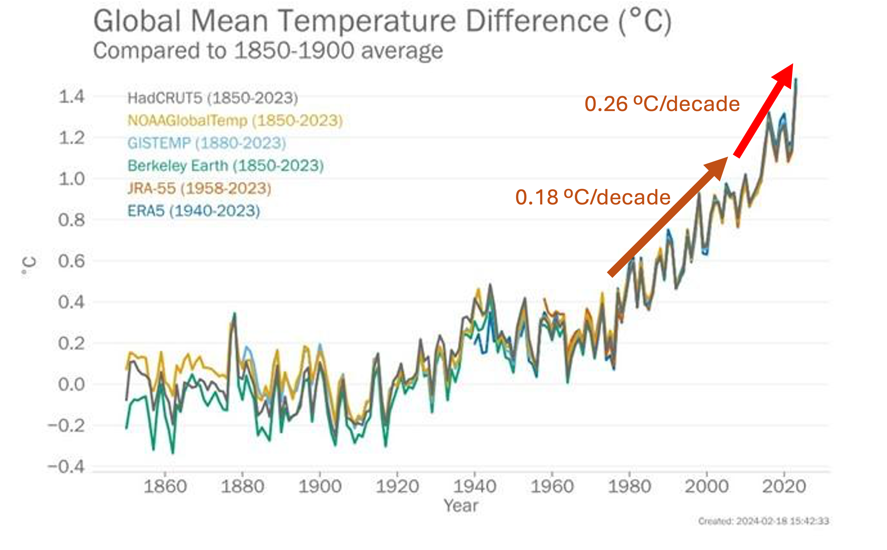
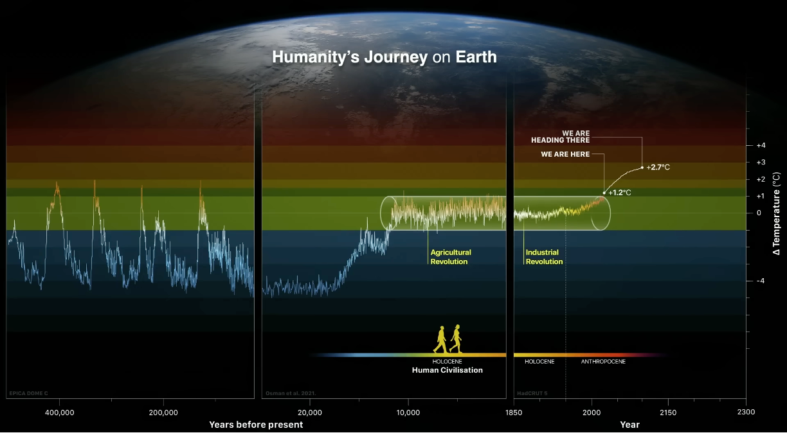
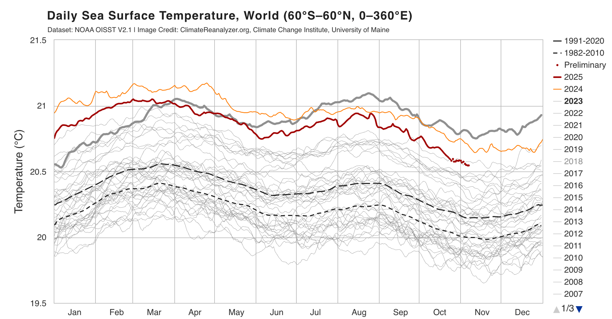
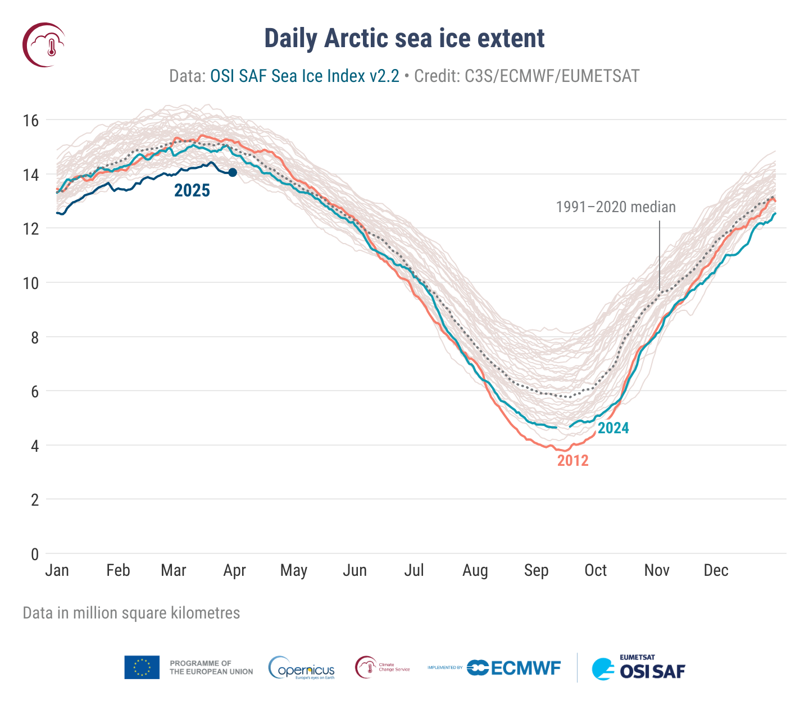
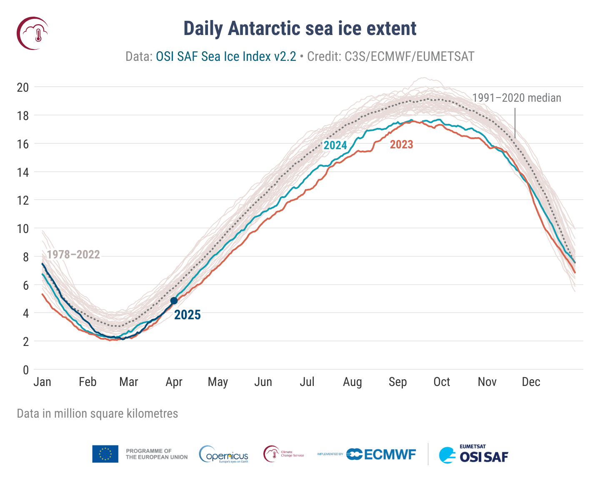
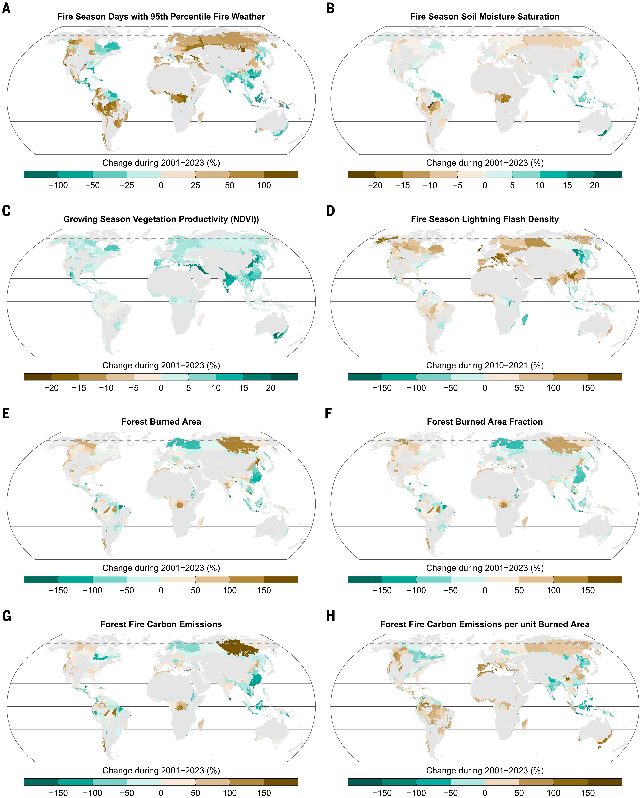
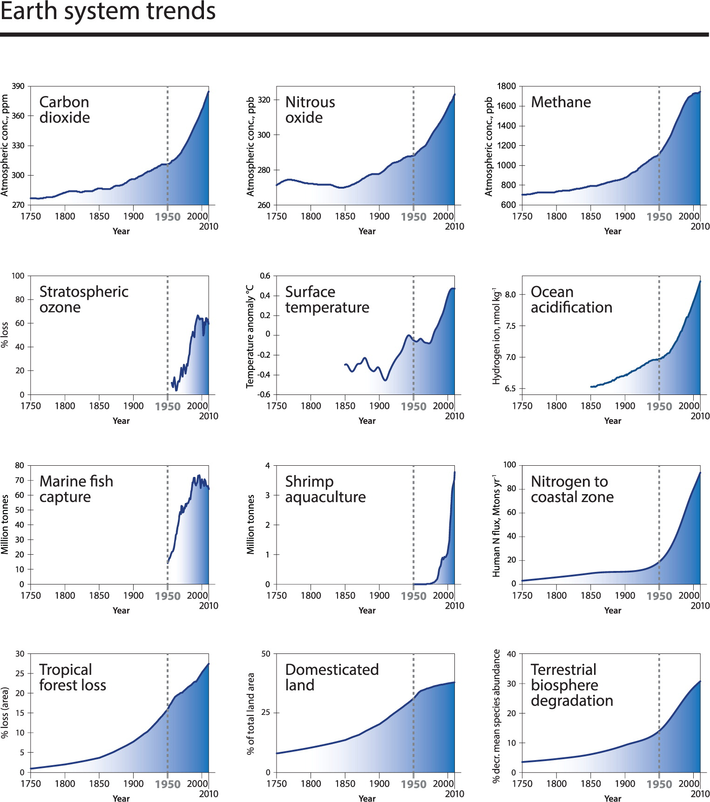
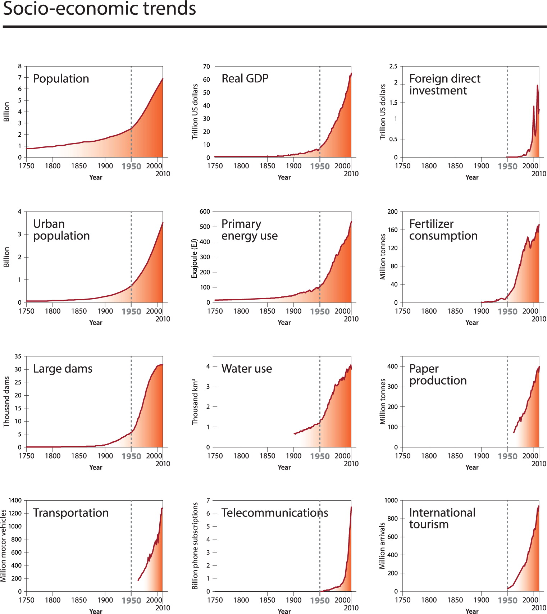

# Overall question

- Question 1: What is climate change, and are there any signs suggest it is happening (What has happened and is happening)?
- Question 2: What are the causes of climate change and the role of human behavior?
- Question 3: What are the differences and connections between climate change and global warming?
- Question 4: What are RCPs and SSPs in climate change research, and how do they differ? How are they used to model future climate scenarios in IPCC?
- Question 5: What are going to happen in the future?

# Some links

## Online videos

- [AR6 Synthesis Report: Climate Change 2023 | IPCC](https://www.youtube.com/watch?v=YIFCSZYU2LM)
- [Nobel Prize lecture: Syukuro Manabe, Nobel Prize in physics 2021](https://www.youtube.com/watch?v=-VNKJ2IbRoo&list=PPSV)
- [The Tipping Points of Climate Change — and Where We Stand | Johan Rockström | TED](https://www.youtube.com/watch?v=Vl6VhCAeEfQ)
- [How scientists calculate climate change | The Economist](https://www.youtube.com/watch?v=fSGorwtY-zM)
- [A Year in the Life of Earth's CO2 | NASA](https://www.youtube.com/watch?v=x1SgmFa0r04&list=PLQVWjfOruX-x7DVigo9P2rfknMVFASc5-)
- [What is climate change? - The Climate Question | BBC](https://www.youtube.com/watch?v=SLEenW2UiUw)
- [Annual Arctic Sea Ice Minimum Area 1979-2022, With Graph | NASA](https://www.youtube.com/watch?v=njoTDqwFuuU)
- [A selection of GraphCast’s predictions rolling across 10 days | Google](https://www.youtube.com/watch?v=xwSirqS8meQ)
- [See what three degrees of global warming looks like | The Economist](https://www.youtube.com/watch?v=uynhvHZUOOo&t=22s)
- [The carbon cycle is key to understanding climate change | The Economist](https://www.youtube.com/watch?v=yhlg9txl7yM)
- [Climate Change Adaptation and Future Climate Projection | CCCA](https://www.youtube.com/watch?v=8jhSHm7qjBg)

## Other links

- [NASA climate change | NASA](https://science.nasa.gov/climate-change/)
- [NASA climate change primer | NASA](https://climateprimer.org/)
- [How to read the Intergovernmental Panel on Climate Change's reports | Carbon Brief](https://www.carbonbrief.org/how-to-read-the-intergovernmental-panel-on-climate-changes-reports/)
- [NOAA climate monitoring | NOAA](https://www.ncei.noaa.gov/access/monitoring/products/)
- [Climate Reanalyzer | Climate Reanalyzer](https://climatereanalyzer.org/)
- [World Glacier Monitoring Service | WGMS](https://wgms.ch/)
- [Understanding Shared Socio-economic Pathways (SSPs) | Climate Data Canada](https://climatedata.ca/resource/understanding-shared-socio-economic-pathways-ssps/)
## Signs of climate change

There are multiple signs suggest climate change is happening, two of types of them are: long-term change and extreme events.

### Temperature rise

By 2024, the global mean surface temperature has risen by 1.45°C compared with the pre-industrial level (1850-1900 average) [^WMO2024]. Recently, the warming rate accelerated.

<b>Figure. Global temperature rise</b>

<figure>
  
  <figcaption><b>Figure. Global temperature rise</b> Trends in global surface temperature from 1880 to 2023. (WMO, 2024)[^WMO2024].</figcaption>
</figure>

<b>Figure. Global temperature history</b>

<figure>
  

    
  

  <figcaption>
    <b>Figure. Global temperature history</b> The temperature has now reached a new point compared to the Holocene.
  </figcaption>
</figure>

<b>Figure. Sea surface temperature</b>

<figure>
  
  <figcaption><b>Figure. Sea surface temperature history</b> The sea surface temperature reached a new record since 2023, compared with previous years. (https://climatereanalyzer.org/clim/sst_daily/?dm_id=world2)</figcaption>
</figure>

### Ice melt

<b>Figure. Arctic sea ice extent</b>

<figure>
  
  <figcaption><b>Figure. Arctic sea ice extent</b> (https://climate.copernicus.eu/sea-ice-cover-march-2025)</figcaption>
</figure>

<b>Figure. Antarctic sea ice extent</b>

<figure>
  
  <figcaption><b>Figure. Antarctic sea ice extent</b> (https://climate.copernicus.eu/sea-ice-cover-march-2025)</figcaption>
</figure>

### Wildfires
<!---
**Intro to [Jones et al., (2024)][Ref1]**: This paper analysis the correlation between different factor, both nature and human indicators, with forest burn area (BA) across the world. This paper reveals the complex causes of wildfire across different eco-regions. Climate change is an important influencer. For instance, decreased soil moisture increases the chance of wildfire and BA in most regions. The change in weather also increases BA. Beyond that, human activities also influence wildfire, in both positive and negative ways. For instance, in tropic forest in Amazon and Congo, the deforestation and increases the chance of wildfire, while in regions like southeast US and western US, fire management is helpful in reduce BA. 
--->
Some observations for Figure [^Jones2024]:

- The extent and severity change of forest fire:
  - Figure E-G. Overall, there are more burn area (BA) in **Russia** (east and northeast Siberian taiga), **Europe** (e.g., Balkan mixed forests, Pindus and Dinaric mountains mixed forests), **western North America** (e.g., Sierra Nevada forests, North-Central Rockies forests, Muskwa-Slave lake forests, Fraser Plateau and Basin complex, and Northwest Territories taiga), **Chile** (Valdivian temperate forests), and **China** (Northeast China Plain deciduous forests and Hengduan Mountains conifer forests).

- The climate information:
  - Figure A. Extreme fire weather days increases in the above mentioned regions.
  - Figure B. Soil moisture decreases in the above mentioned regions.
  - Figure D. 

- Vegetation information:
  - Figure C: Overall, plant NDVI increases in most regions.

<b>Figure. Bioclimatic variables and forest fire observations</b>

<figure>
  

    
  

  <figcaption><b>Figure. Bioclimatic variables and forest fire observations</b> Changes in bioclimatic variables and forest fire observations at ecoregion level (Jones et al., 2024). Fire weather index is an indicator for fire risk. It combines weather data (i.e., temperature, humidity, wind speed and 24-hour precipitation). FWI decreases with fuel moisture levels and increases with dry fuel availability. The baseline for A is the FWI from 1980 to 2009.</figcaption>
</figure>

#### Some papers:

> Intro to **Jones et al., (2024)[^Jones2024]**: This paper analysis the correlation between different factor, both nature and human indicators, with forest burn area (BA) across the world. This paper reveals the complex causes of wildfire across different eco-regions. Climate change is an important influencer. For instance, decreased soil moisture increases the chance of wildfire and BA in most regions. The change in weather also increases BA. Beyond that, human activities also influence wildfire, in both positive and negative ways. For instance, in tropic forest in Amazon and Congo, the deforestation and increases the chance of wildfire, while in regions like southeast US and western US, fire management is helpful in reduce BA. More details in the paper.
<figure>
  
  <figcaption><b>Figure. Earth system trends</b> Trends from 1750 to 2010 in indicators for the structure and functioning of the Earth System. (Steffen et al., 2015).</figcaption>
</figure>
<!---
[Ref1]: https://www.science.org/doi/10.1126/science.adl5889 "Jones, M.W., Veraverbeke, S., Andela, N., Doerr, S.H., Kolden, C., Mataveli, G., Pettinari, M.L., Le Quéré, C., Rosan, T.M., van der Werf, G.R. and van Wees, D., 2024. Global rise in forest fire emissions linked to climate change in the extratropics. Science, 386(6719), p.eadl5889."
--->

## 

## Others

### Human activities changes in the past

<figure>
  
  <figcaption><b>Figure. socio-economic development</b> Trends from 1750 to 2010 in globally aggregated indicators for socio-economic development. (Steffen et al., 2015). The figure illustrates the "Great Acceleration" in human activities since the mid-20th century, highlighting key indicators such as population growth, economic activity, and resource consumption.</figcaption>
</figure>

#### Some cases:
> Intro to **Steffen et al., (2015)[^Steffen2015]**: This paper discusses the concept of the Anthropocene and the significant changes in human activities and their impact on the Earth system. It highlights the "Great Acceleration" in human activities since the mid-20th century, which has led to unprecedented changes in the environment, including climate change, biodiversity loss, and alterations to biogeochemical cycles.

## IPCC report

### Scenarios in climate change research

The rationale of scenarios are:

1. Future is uncertain, especially for long-term prediction (e.g., 50 years or 100 years later). Scenarios provide a way to explore different possible futures based on varying assumptions about key driving forces.
2. Scenarios help in understanding the potential impacts of different policy choices and actions on climate change.
3. They facilitate communication and decision-making among policymakers, researchers, and the public by providing a common framework for discussing future climate change.

#### RCPs

RCPs is the abbreviation of Representative Concentration Pathways. They are greenhouse gas concentration (not emissions) trajectories adopted by the IPCC for its fifth Assessment Report (AR5) in 2014. There are four RCPs: RCP2.6, RCP4.5, RCP6, and RCP8.5. The numbers refer to the possible range of radiative forcing values in the year 2100 relative to pre-industrial values (+2.6, +4.5, +6.0, and +8.5 W/m², respectively) [^Moss2010][^Vuuren2011].

- *Representative*: each of the RCPs represents a larger set of scenarios in the literature.  
- *Pathways*: are internally consistent sets of projections of the components of radiative forcing that are used in subsequent phases
- *Concentration*: emphasizes that concentrations are used as the primary product of the RCPs, designed as input to climate models

<figure>
  
  <figcaption> <b>Table RCP1</b>.Overview of RCPs.</figcaption>
</figure>

<figure>
  
  <figcaption><b>Figure. IPCC relationships between the various groups</b> (Moss et al., 2008).</figcaption>
</figure>

##### Definition of RCPs from IPCC:  

Scenarios that include time series of emissions and concentrations of the full suite of greenhouse gases (GHGs) and aerosols and chemically active gases, as well as land use/land cover (Moss et al. 2010). The word representative signifies that each RCP provides only one of many possible scenarios that would lead to the specific radiative forcing characteristics. The term pathway emphasises that not only the long-term concentration levels are of interest, but also the trajectory taken over time to reach that outcome (Moss et al. 2010). RCPs usually refer to the portion of the concentration pathway extending up to 2100, for which integrated assessment models produced corresponding emission scenarios. Extended concentration pathways describe extensions of the RCPs from 2100 to 2300 that were calculated using simple rules generated by stakeholder consultations, and do not represent fully consistent scenarios. Four RCPs produced from integrated assessment models were selected from the published literature and used in the Fifth IPCC Assessment, and are also used in this Assessment for comparison, spanning the range from approximately below 2°C warming to high (>4°C) warming best-estimates by the end of the 21st century: RCP2.6, RCP4.5 and RCP6.0 and RCP8.5.

- RCP2.6: One pathway where radiative forcing peaks at approximately 3 W m–2 and then declines to be limited at 2.6 W m–2 in 2100 (the corresponding Extended Concentration Pathway, or ECP, has constant emissions after 2100).
- RCP4.5 and RCP6.0: Two intermediate stabilisation pathways in which radiative forcing is limited at approximately 4.5 W m–2 and 6.0 W m–2 in 2100 (the corresponding ECPs have constant concentrations after 2150).
- RCP8.5: One high pathway which leads to >8.5 W m–2 in 2100 (the corresponding ECP has constant emissions after 2100 until 2150 and constant concentrations after 2250).

**Usage of RCPs** [^Moss2008]:

1. Input to CMs
2. To facilitate pattern scaling of climate model outcomes. 
3. To explore the range of socioeconomic conditions consistent with a given concentration pathway. 
4. To explore the climate implications of spatial forcing patterns.
  
**Limitations of RCPs** [^Moss2008]:

1. They should not be considered forecasts or absolute bounds. 
2. They should not be considered policy-prescriptive.
3. The socioeconomic scenarios underlying each RCP should not be considered unique. 
4. The socioeconomic scenarios underlying the RCPs cannot be treated as a set with an overarching internal logic.
5. There are uncertainties in the translation of emissions profiles to concentrations and radiative forcing. 

#### Some cases:
> Intro to **Moss et al., (2010)[^Moss2010]**: This paper give a introduction to the new generation of scenarios, including the rationales, history and brieft description of generation process. It also discusses the integration of RCPs with socio-economic scenarios, which are later developed into SSPs.

> Intro to **Vuuren et al., (2011)[^Vuuren2011]**: This paper provides an detailed overview of the Representative Concentration Pathways (RCPs), including their development, characteristics, and applications in climate change research. 

#### SSPs

The RCPs gives the possible trajectrories of forcing (greenhouse gas concentrations) to a certain level of radiative forcing in 2100. However, they do not provide information about the socio-economic conditions that lead to these trajectories. Therefore, Shared Socioeconomic Pathways (SSPs) were developed to fill this gap. SSPs are scenarios that describe different pathways of socio-economic development, including factors such as population growth, economic development, technological progress, and environmental policies [^Moss2010][^Riahi2017]. The purpose of SSPs is to provide broad descriptions of future conditions that are relevant for both the analysis of emissions
drivers and mitigation strategies, and the analysis of societal vulnerability to climate change, climate impacts and potential adaptation measures [^ONeill2017]].

SSPs are the input for the integrated assessment models.

<b>Figure. Mitigation and adaptation challenges in five SSPs</b>

<figure>
  

    
  

  <figcaption><b>Figure. Mitigation and adaptation challenges in five SSPs </b> (O'Neill et al., 2017).</figcaption>
</figure>

<b>Figure. Narritive summary of five SSPs</b>

<figure>
  

    
  

  <figcaption><b>Figure. Narritive summary of five SSPs </b> (https://climatedata.ca/resource/understanding-shared-socio-economic-pathways-ssps/) </figcaption>
</figure>

##### Definition of SSPs from IPCC
SSPs have been developed to complement the Representative Concentration Pathways (RCPs). By design, the RCP emission and concentration pathways were stripped of their association with a certain socio-economic development. Different levels of emissions and climate change along the dimension of the RCPs can hence be explored against the backdrop of different socio-economic development pathways (SSPs) on the other dimension in a matrix. This integrative SSP-RCP framework is now widely used in the climate impact and policy analysis literature, where climate projections obtained under the RCP scenarios are analysed against the backdrop of various SSPs. As several emission updates were due, a new set of emission scenarios was developed in conjunction with the SSPs. Hence, the abbreviation SSP is now used for two things: On the one hand SSP1, SSP2, …, SSP5 are used to denote the five socio-economic scenario families. On the other hand, the abbreviations SSP1‑1.9, SSP1‑2.6, …, SSP5‑8.5 are used to denote the newly developed emission scenarios that are the result of an SSP implementation within an integrated assessment model. Those SSP scenarios are bare of climate policy assumption, but in combination with so-called shared policy assumptions (SPAs), various approximate radiative forcing levels of 1.9, 2.6, …, or 8.5 W m–2 are reached by the end of the century, respectively.

#### Some papers:

> Intro to **O'Neill et al., (2017)[^ONeill2017]**: This paper give an overview of the Shared Socioeconomic Pathways (SSPs), including the rationales, intro to its development process, and high-level narratives for each SSP, the summary of the assumptions for 1) demographic and human development elements, 2) Economy & Lifestyle and Policies & Institutions elements, 3) Technology and Environment & Natural Resources elements.
> > **Example narrative for SSP3**: "A resurgent nationalism, concerns about competitiveness and security, and regional conflicts push countries to increasingly focus on domestic or, at most, regional issues. This trend is reinforced by the limited number of comparatively weak global institutions, with uneven coordination and cooperation for addressing environmental and other global concerns. Policies shift over time to become increasingly oriented toward national and regional security issues, including barriers to trade, particularly in the energy resource and agricultural markets. Countries focus on achieving energy and food security goals within their own regions at the expense of broader-based development, and in several regions move toward more authoritarian forms of government with highly regulated economies. Investments in education and technological development decline. Economic development is slow, consumption is material-intensive, and inequalities persist or worsen over time, especially in developing countries. There are pockets of extreme poverty alongside pockets of moderate wealth, with many countries struggling to maintain living standards and provide access to safe water, improved sanitation, and health care for disadvantaged populations. A low international priority for addressing environmental concerns leads to strong environmental degradation in some regions. The combination of impeded development and limited environmental concern results in poor progress toward sustainability. Population growth is low in industrialized and high in developing countries. Growing resource intensity and fossil fuel dependency along with difficulty in achieving international cooperation and slow technological change imply high challenges to mitigation. The limited progress on human development, slow income growth, and lack of effective institutions, especially those that can act across regions, implies high challenges to adaptation for many groups in all regions."

> Intro to **Riahi et al., (2017)[^Riahi2017]**: This paper presents the overview of the Shared Socioeconomic Pathways (SSPs) and their energy, land use, and emissions implications.

# References:

[^Jones2024]: [Jones, M.W., Veraverbeke, S., Andela, N., Doerr, S.H., Kolden, C., Mataveli, G., Pettinari, M.L., Le Quéré, C., Rosan, T.M., van der Werf, G.R. and van Wees, D., 2024. Global rise in forest fire emissions linked to climate change in the extratropics. Science, 386(6719), p.eadl5889.](https://www.science.org/doi/10.1126/science.adl5889)
[^Steffen2015]: [Steffen, W., Broadgate, W., Deutsch, L., Gaffney, O. and Ludwig, C., 2015. The trajectory of the Anthropocene: the great acceleration. The anthropocene review, 2(1), pp.81-98.](https://journals.sagepub.com/doi/10.1177/2053019614564785)
[^Moss2010]: [Moss, R.H., Edmonds, J.A., Hibbard, K.A., Manning, M.R., Rose, S.K., Van Vuuren, D.P., Carter, T.R., Emori, S., Kainuma, M., Kram, T. and Meehl, G.A., 2010. The next generation of scenarios for climate change research and assessment. Nature, 463(7282), pp.747-756.](https://www.nature.com/articles/nature08823)
[^ONeill2017]: [O'Neill, B.C., Kriegler, E., Ebi, K.L., Kemp-Benedict, E., Riahi, K., Rothman, D.S., van Ruijven, B.J., van Vuuren, D.P., Birkmann, J., Kok, K. and Levy, M., 2017. The roads ahead: Narratives for shared socioeconomic pathways describing world futures in the 21st century. Global Environmental Change, 42, pp.169-180.](https://www.sciencedirect.com/science/article/pii/S0959378015000060)
[^Riahi2017]: [Riahi, K., Van Vuuren, D.P., Kriegler, E., Edmonds, J., O’neill, B.C., Fujimori, S., Bauer, N., Calvin, K., Dellink, R., Fricko, O. and Lutz, W., 2017. The Shared Socioeconomic Pathways and their energy, land use, and greenhouse gas emissions implications: An overview. Global environmental change, 42, pp.153-168.](https://www.sciencedirect.com/science/article/pii/S0959378016300681)
[^Vuuren2011]: [Van Vuuren, D.P., Edmonds, J., Kainuma, M., Riahi, K., Thomson, A., Hibbard, K., Hurtt, G.C., Kram, T., Krey, V., Lamarque, J.F. and Masui, T., 2011. The representative concentration pathways: an overview. Climatic change, 109(1), p.5.](https://link.springer.com/article/10.1007/s10584-011-0148-z)
[^Moss2008]: [Moss, R.H., Babiker, M., Brinkman, S., Calvo, E., Carter, T., Edmonds, J.A., Elgizouli, I., Emori, S., Lin, E., Hibbard, K. and Jones, R., 2008. Towards new scenarios for analysis of emissions, climate change, impacts, and response strategies.](https://archive.ipcc.ch/pdf/supporting-material/expert-meeting-report-scenarios.pdf)
[^WMO2024]: [World Meteorological Organization, 2024. State of the Global Climate 2023](https://wmo.int/publication-series/state-of-global-climate-2023)